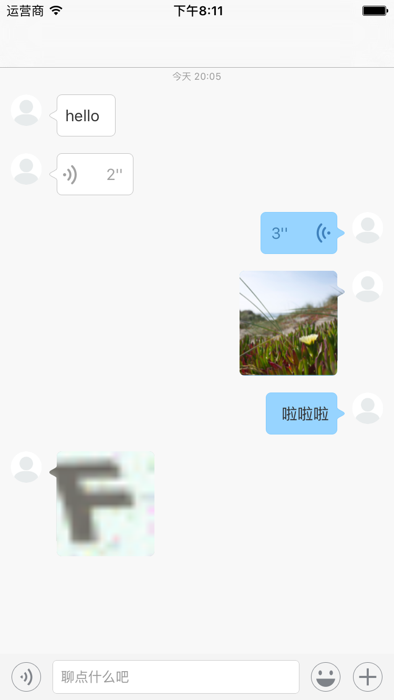

TLMessage
==================

# TODO
* 群聊
* 文件消息

# Introduce
* 这是一个IMUI库。对接了目前比较流行的RongCloud实现聊天功能。

# System Requirement
* iOS 8.0 or later
* Xcode 8.0 or later

# Character
* 接入融云IMLib，支持Text/Image/Voice/Location消息收发
* 支持发送状态提示，失败重发
* 完全使用AutoLayout布局
* 支持扩展面板扩展
* 支持Emoji输入

# Depend on Framwork
* Masonry AutoLayout
* FDTemplateLayoutCell Cell自适应高度
* SDWebImage
* RongCloudIMLib 融云通讯能力库

# Usage
* 克隆项目后，需要使用Cocoapods install

# Warning！
* 部分图片素材来源于融云IMKit，使用前请替换资源图片
* 目前项目尚处于开发阶段，不建议直接在企业项目中使用。

# Images

